<div align="center">

# CareerPilot

**Open-source AI career platform for resumes, interviews, and professional profiles**

Build professional resumes, practice mock interviews, generate professional photos, and operate managed AI services from one bilingual platform.

[](LICENSE)
[](https://nextjs.org/)
[](https://react.dev/)
[](https://www.typescriptlang.org/)
[](#docker-recommended)
[](https://github.com/Aidenwu0209/careerpilot/actions/workflows/quality.yml)

[中文文档](./README.zh-CN.md) · [Quick Start](#getting-started) · [Operations Guide](docs/commercial-operations.zh-CN.md) · [Contributing](CONTRIBUTING.md)

</div>

---

CareerPilot covers the job-seeking workflow from resume creation and JD matching to mock interviews and professional photo generation. It supports self-hosted development with SQLite, production deployment with PostgreSQL, and an optional commercial layer for managed models, credits, plans, payments, refunds, reconciliation, and operational alerts.

Product scope and implementation status are maintained in [docs/PRODUCT-OVERVIEW.md](docs/PRODUCT-OVERVIEW.md).

> **Project status:** `main` is the stable branch. `develop/careerpilot` contains the latest development work. External AI, payment, email, storage, and monitoring services require your own credentials and configuration.

## Screenshots

| Template Gallery | Resume Editor |
|:---:|:---:|
| 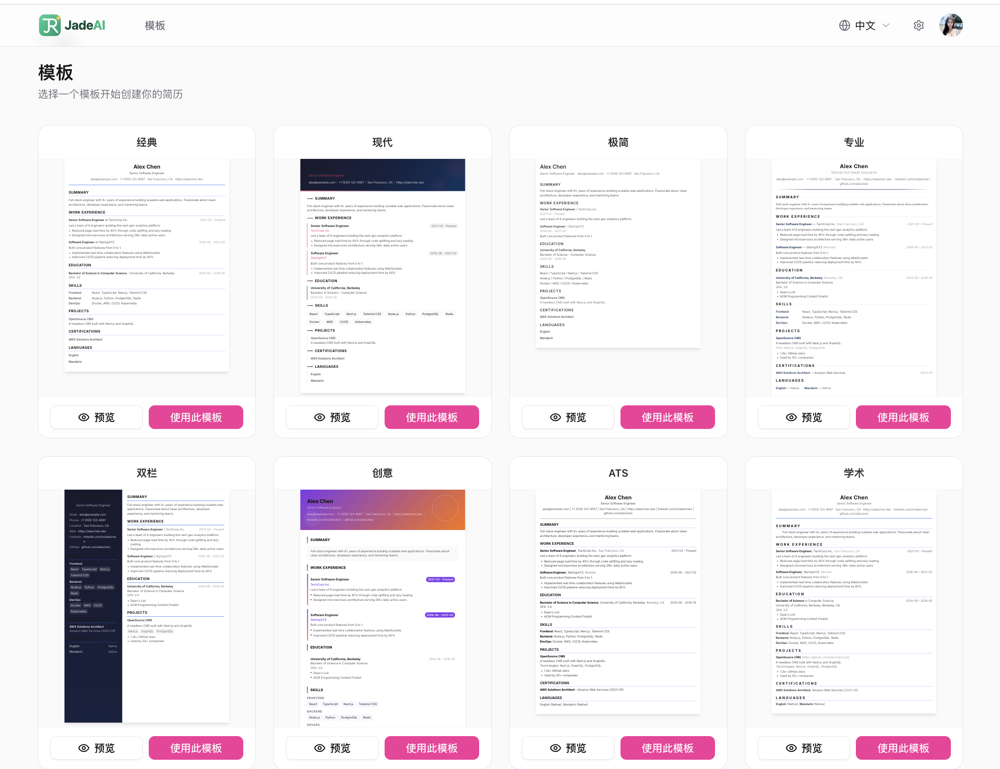 | 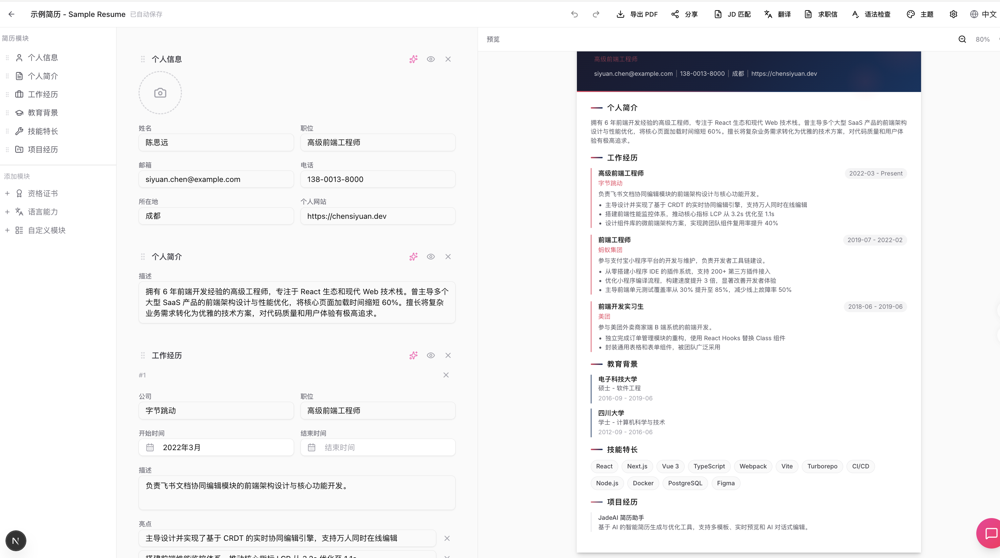 |

| AI Resume Generation | AI Resume Parsing (Image) |
|:---:|:---:|
|  | 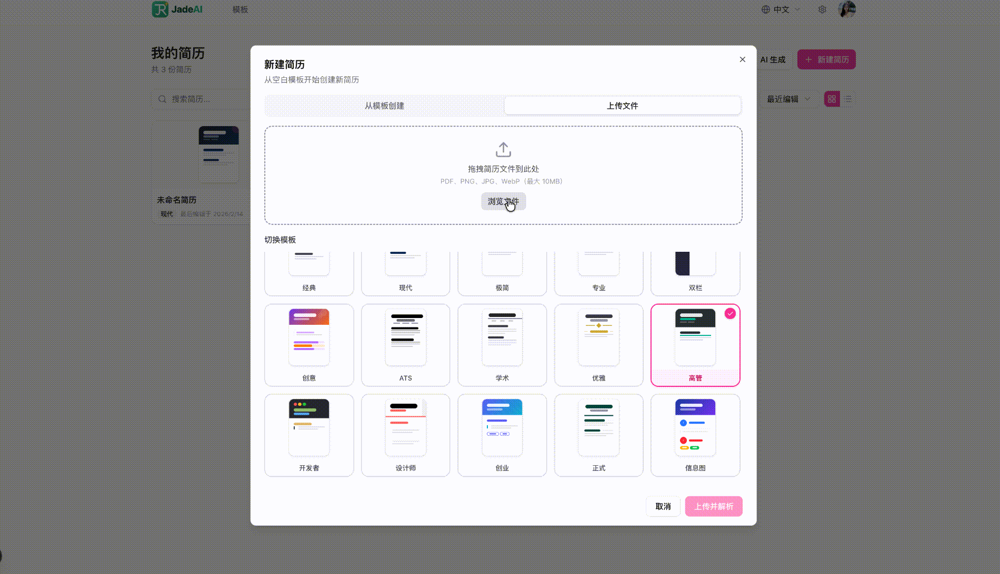 |

| AI Optimization | Grammar Check |
|:---:|:---:|
|  |  |

| Grammar Auto-Fix | JD Match Analysis |
|:---:|:---:|
|  |  |

| Multi-Format Export | Share Link |
|:---:|:---:|
| 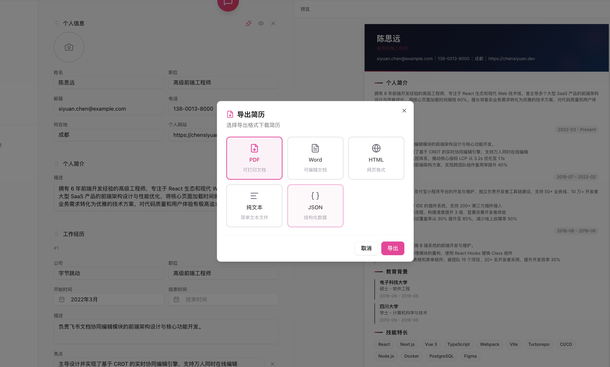 | 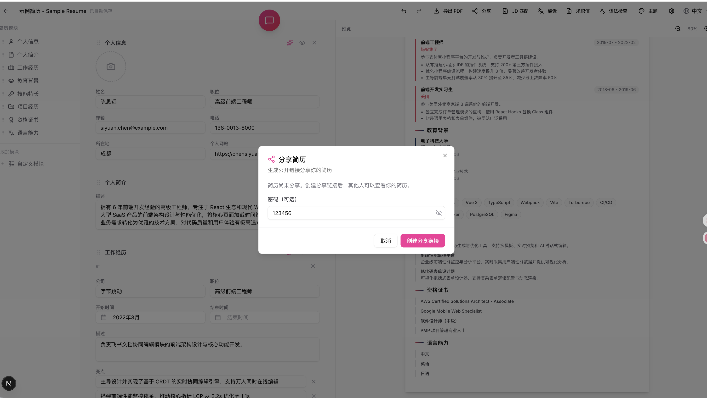 |

| Shared Resume Page | AI Professional Photo |
|:---:|:---:|
| 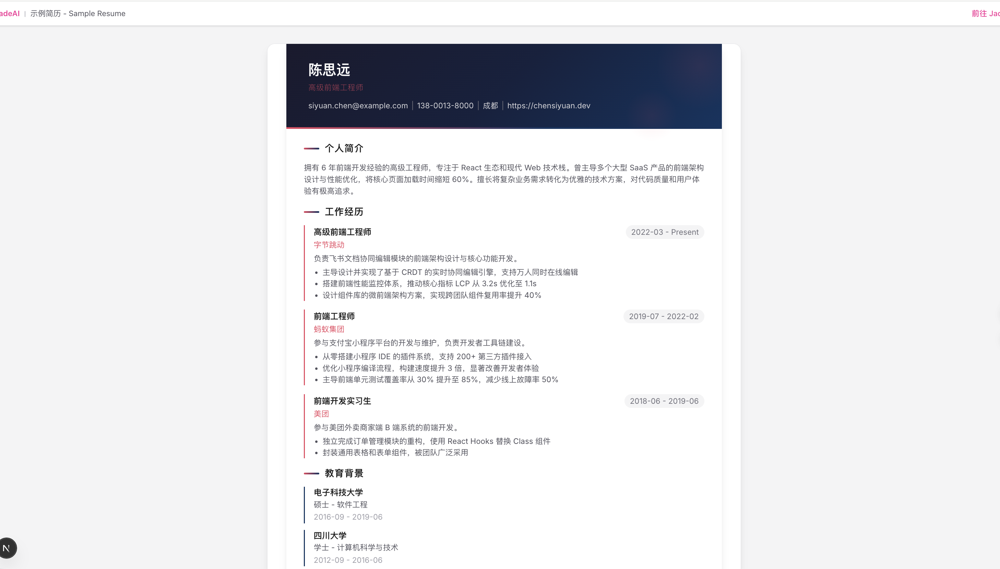 |  |

| QR Code Section |
|:---:|
| 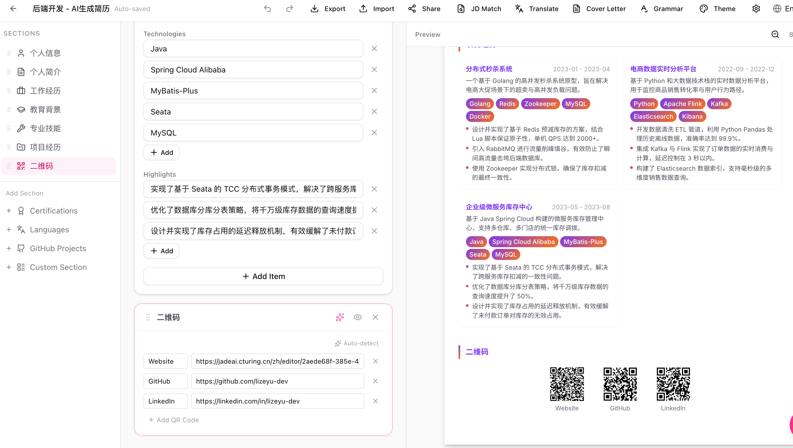 |

| Interview Setup | Mock Interview |
|:---:|:---:|
| 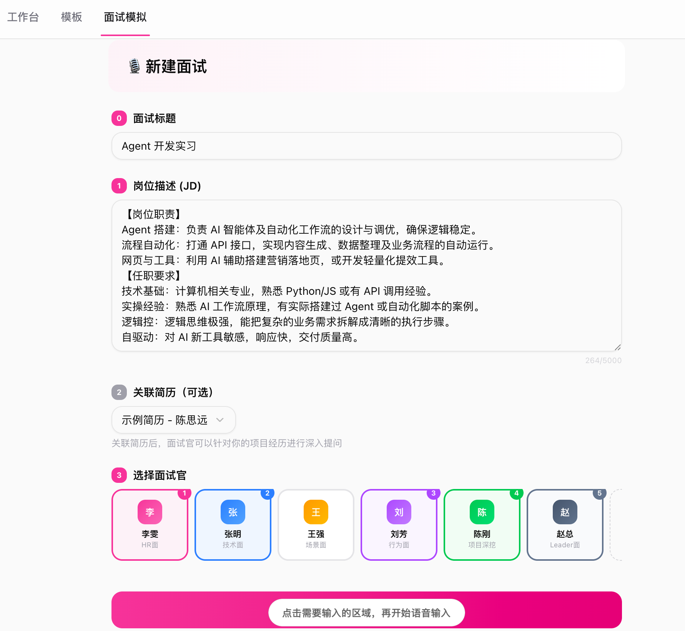 | 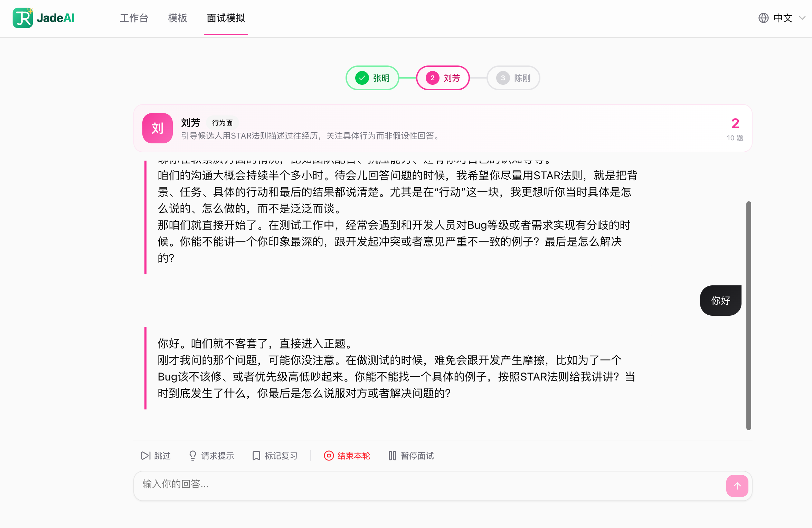 |

| Interview List | Interview Report |
|:---:|:---:|
| 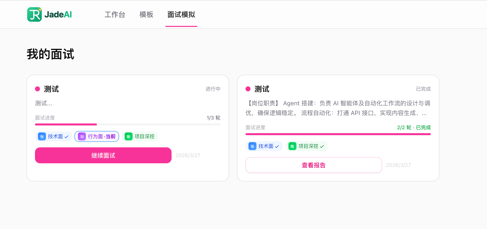 | 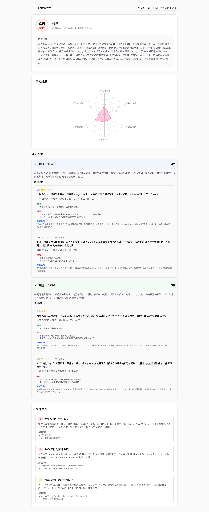 |

## Features

### Resume Editing

- **Drag & Drop Editor** — Visually arrange and reorder resume sections and items
- **Inline Editing** — Click any field to edit directly on the canvas
- **50 Professional Templates** — Classic, Modern, Minimal, Creative, ATS-Friendly, Timeline, Nordic, Swiss, and more
- **Theme Customization** — Colors, fonts, spacing, and margins with live preview
- **Undo / Redo** — Full edit history (up to 50 steps)
- **Auto Save** — Configurable interval (0.3s–5s), with manual save option
- **Markdown Support** — Use Markdown syntax in text fields to format content (e.g., `**bold**` for **bold text**)

### Markdown Formatting

The following resume sections support Markdown syntax:

| Section | Supported Fields |
|---------|-----------------|
| Summary | Content text |
| Work Experience | Description, Highlights |
| Education | Highlights |
| Projects | Description, Highlights |
| Custom Section | Description |
| Languages | Description |
| GitHub | Description |

**Supported syntax:**

```
**bold text**    → bold
`code text`      → inline code
- item           → bullet list
```

> Skills, Certifications, and Personal Info fields do not support Markdown.

### AI Capabilities

- **AI Chat Assistant** — Conversational AI integrated in the editor, with multi-session support and persistent history
- **AI Resume Generation** — Generate a complete resume from job title, experience, and skills
- **Resume Parsing** — Upload an existing PDF or image, AI extracts all content automatically
- **JD Match Analysis** — Compare resume against a job description: keyword matching, ATS score, and improvement suggestions
- **Cover Letter Generation** — AI-tailored cover letter based on resume and JD, with tone selection (formal / friendly / confident)
- **Grammar & Writing Check** — Detect weak verbs, vague descriptions, and grammar issues; returns a quality score
- **Translation** — Translate resume content across 10 languages while preserving technical terms
- **Managed AI Providers** — Super administrators publish approved GPT, Claude, GLM, and DeepSeek models with encrypted credentials
- **Commercial Credits** — Personal and organization accounts support pre-authorization, per-call/per-token settlement, immutable ledgers, and limits
- **Multi-provider Image Editing** — Professional photos support approved Gemini, GPT, and ERNIE image models; GPT products can be priced as separate 1K and 4K tiers

### Mock Interview

- **JD-Based Interview Simulation** — Paste a job description, AI plays different interviewer roles in sequence
- **6 Preset Interviewers** — HR, Technical, Scenario, Behavioral, Project Deep Dive, Leader — each with unique personality and questioning style
- **Custom Interviewers** — Create your own interviewer with custom focus areas and style
- **Smart Follow-ups** — AI adapts questions based on answer quality, probing deeper when needed
- **Interview Controls** — Skip questions, request hints, mark for review, pause/resume
- **Detailed Report** — Per-question scoring, competency radar chart, improvement plan with resources
- **History Comparison** — Track score trends and dimension progress across interviews
- **PDF & Markdown Export** — Export interview reports for offline review

### Export & Sharing

- **Multi-Format Export** — PDF (Puppeteer + Chromium), Smart One-Page PDF (auto-fit to single page), DOCX, HTML, TXT, JSON
- **JSON Import** — Import a previously exported JSON file to restore or create a resume; supported both in the editor (overwrite current) and on the dashboard (create new)
- **Link Sharing** — Token-based shareable links with optional password protection
- **View Counter** — Track how many times a shared resume has been viewed

### Management

- **Multi-Resume Dashboard** — Grid and list views, search, sort (by date, name)
- **Import from JSON** — Create a new resume from a JSON export directly on the dashboard
- **Duplicate & Rename** — Quick resume management actions
- **Interactive Tours** — Step-by-step onboarding for first-time users

### Other

- **Bilingual UI** — Full Chinese (zh) and English (en) interface
- **Dark Mode** — Light, dark, and system theme support
- **Product Auth** — Separate password registration and login, plus optional email-code and Google login
- **Dual Database** — SQLite (default, zero-config) or PostgreSQL

## Tech Stack

| Layer | Technology |
|-------|-----------|
| Framework | Next.js 16 (App Router, Turbopack) |
| UI | React 19, Tailwind CSS 4, shadcn/ui, Radix UI |
| Drag & Drop | @dnd-kit |
| State | Zustand |
| Database | Drizzle ORM (SQLite / PostgreSQL) |
| Auth | Signed sessions + salted scrypt password credentials + optional email OTP / Google OAuth |
| AI | Vercel AI SDK v6 + managed GPT / Claude / GLM / DeepSeek / Gemini / ERNIE providers |
| PDF | Puppeteer Core + @sparticuz/chromium |
| i18n | next-intl |
| Validation | Zod v4 |

## Getting Started

### Docker (Recommended)

For the production Compose topology, health checks, Redis-backed rate limiting,
connection-pool settings, upgrades, and rollback procedure, see
[docs/DEPLOYMENT.md](docs/DEPLOYMENT.md).

```bash
# Create an untracked deployment environment file and replace every placeholder.
cp .env.example .env

# Edit .env: set APP_URL, AUTH_SECRET and AI_CREDENTIAL_MASTER_KEY, and add
# POSTGRES_PASSWORD with a random value.
# then start the supported PostgreSQL + Redis topology.
docker compose up -d --build
docker compose ps
```

Open the configured `APP_URL`. The database migrates automatically, but provider credentials and AI models are intentionally **not** seeded. Never commit an API key or add a server-side `GEMINI_API_KEY` fallback.

> **AI Configuration:** Generate a dedicated `AI_CREDENTIAL_MASTER_KEY`, bootstrap a super administrator, configure a provider credential, test it, and then publish approved models. Image generation additionally requires upstream model entitlement and quota. Follow [Managed AI and image setup](docs/DEPLOYMENT.md#managed-ai-and-image-setup).

<details>
<summary>With Google OAuth</summary>

```bash
docker build -t careerpilot .
docker run -d -p 3000:3000 \
  -e AUTH_SECRET=your-secret \
  -e GOOGLE_CLIENT_ID=xxx \
  -e GOOGLE_CLIENT_SECRET=xxx \
  -v careerpilot-data:/app/data \
  careerpilot
```

</details>

### Local Development

#### Prerequisites

- Node.js 22 (recommended; matches CI)
- pnpm 10.29.2

#### Installation

```bash
git clone https://github.com/Aidenwu0209/careerpilot.git
cd careerpilot

pnpm install
cp .env.example .env.local
```

#### Configure Environment

Edit `.env.local`:

```bash
# Database (defaults to SQLite, no config needed)
DB_TYPE=sqlite

# Product mode is the default and supports password registration/login.
# Configure SMTP_* only when email-code login is also required.
DEMO_MODE=false

# Required before an administrator saves any managed provider credential.
# Use a different value from AUTH_SECRET and keep it stable.
AI_CREDENTIAL_MASTER_KEY=<openssl-rand-base64-48-output>
```

> **AI Configuration:** No provider key or model is bundled. Configure providers and encrypted credentials in **Admin > AI Providers**, then publish approved models through the managed catalog. For LinkedIn Photo, publish at least one public model with `image_generation` capability and verify that the upstream account includes that model and has quota.

See `.env.example` for all available options (Google OAuth, PostgreSQL, etc.).

#### Initialize Database & Run

```bash
# Generate and run migrations
pnpm db:generate
pnpm db:migrate

# (Optional) Seed with sample data
pnpm db:seed

# Start dev server
pnpm dev
```

Open [http://localhost:3000](http://localhost:3000).

### API Reference

The checked-in OpenAPI 3.1 contract is available at [`public/openapi.json`](public/openapi.json) and is rendered by the application at [`/api-docs`](http://localhost:3000/api-docs). Keep it synchronized with Route Handlers by running:

```bash
pnpm openapi:generate
pnpm openapi:check
```

The coverage check fails when an implemented API operation is missing from the contract, when a stale operation remains, or when a path parameter is not declared.

## Environment Variables

| Variable | Required | Default | Description |
|----------|----------|---------|-------------|
| `AUTH_SECRET` | Yes | — | Secret key for session encryption |
| `AI_CREDENTIAL_MASTER_KEY` | Before saving AI credentials; always in production | — | Dedicated key for encrypting managed provider credentials; must differ from `AUTH_SECRET` |
| `BOOTSTRAP_SUPER_ADMIN_EMAIL` | For first admin setup | — | Existing account promoted to `super_admin` on the next service start |
| `DB_TYPE` | No | `sqlite` | Database type: `sqlite` or `postgresql` |
| `DATABASE_URL` | When PostgreSQL | — | PostgreSQL connection string |
| `SQLITE_PATH` | No | `./data/careerpilot.db` | SQLite database file path |
| `DEMO_MODE` | No | `false` | Enable isolated seeded identities at locale-aware `/demo` (never enable in production) |
| `GOOGLE_CLIENT_ID` | Optional | — | Google OAuth client ID; configure together with the client secret |
| `GOOGLE_CLIENT_SECRET` | Optional | — | Google OAuth client secret; configure together with the client ID |
| `SMTP_HOST` | Optional | — | SMTP server used to enable email-code login |
| `SMTP_PORT` | No | `587` | SMTP server port |
| `SMTP_USER` | Depending on SMTP | — | SMTP username |
| `SMTP_PASS` | Depending on SMTP | — | SMTP password |
| `SMTP_FROM` | Depending on SMTP | — | Sender address for verification emails |
| `APP_NAME` | No | `CareerPilot` | Application display name |
| `DEFAULT_LOCALE` | No | `zh` | Default language: `zh` or `en` |

## Scripts

| Command | Description |
|---------|-------------|
| `pnpm dev` | Start dev server with Turbopack |
| `pnpm build` | Production build |
| `pnpm start` | Start production server |
| `pnpm lint` | Run ESLint |
| `pnpm type-check` | TypeScript type checking |
| `pnpm db:generate` | Generate Drizzle migrations (SQLite) |
| `pnpm db:generate:pg` | Generate Drizzle migrations (PostgreSQL) |
| `pnpm db:migrate` | Execute database migrations |
| `pnpm db:studio` | Open Drizzle Studio (database GUI) |
| `pnpm db:seed` | Seed demo student/teacher identities only; does not add provider credentials or AI models |

## Project Structure

```
src/
├── app/                        # Next.js App Router
│   ├── [locale]/               # i18n routes (/zh/..., /en/...)
│   │   ├── dashboard/          # Resume list & management
│   │   ├── editor/[id]/        # Resume editor
│   │   ├── preview/[id]/       # Full-screen preview
│   │   ├── templates/          # Template gallery
│   │   └── share/[token]/      # Public shared resume viewer
│   └── api/
│       ├── ai/                 # AI endpoints
│       │   ├── chat/           #   Streaming chat with tool calls
│       │   ├── generate-resume/#   AI resume generation
│       │   ├── jd-analysis/    #   JD match analysis
│       │   ├── grammar-check/  #   Grammar & writing check
│       │   ├── cover-letter/   #   Cover letter generation
│       │   ├── translate/      #   Resume translation
│       │   └── models/         #   List available AI models
│       ├── resume/             # Resume CRUD, export, parse, share
│       ├── share/              # Public share access
│       ├── user/               # User profile & settings
│       └── auth/               # NextAuth handlers
├── components/
│   ├── ui/                     # shadcn/ui base components
│   ├── editor/                 # Editor canvas, sections, fields, dialogs
│   ├── ai/                     # AI chat panel & bubble
│   ├── preview/templates/      # 50 resume templates
│   ├── dashboard/              # Dashboard cards, grid, dialogs
│   └── layout/                 # Header, theme provider, locale switcher
├── lib/
│   ├── db/                     # Schema, repositories, migrations, adapters
│   ├── auth/                   # Auth configuration
│   └── ai/                     # AI prompts, tools, model config
├── hooks/                      # Custom React hooks (7 hooks)
├── stores/                     # Zustand stores (resume, editor, settings, UI, tour)
└── types/                      # TypeScript type definitions
```

## Templates

CareerPilot includes **50 professionally designed resume templates** covering a wide range of styles and industries:

<details>
<summary>View all 50 templates</summary>

| # | Template | # | Template | # | Template |
|---|----------|---|----------|---|----------|
| 1 | Classic | 18 | Clean | 35 | Material |
| 2 | Modern | 19 | Bold | 36 | Medical |
| 3 | Minimal | 20 | Timeline | 37 | Luxe |
| 4 | Professional | 21 | Nordic | 38 | Retro |
| 5 | Two-Column | 22 | Gradient | 39 | Card |
| 6 | ATS | 23 | Magazine | 40 | Rose |
| 7 | Academic | 24 | Corporate | 41 | Teacher |
| 8 | Creative | 25 | Consultant | 42 | Coder |
| 9 | Elegant | 26 | Swiss | 43 | Zigzag |
| 10 | Executive | 27 | Metro | 44 | Neon |
| 11 | Developer | 28 | Architect | 45 | Scientist |
| 12 | Designer | 29 | Japanese | 46 | Blocks |
| 13 | Startup | 30 | Artistic | 47 | Ribbon |
| 14 | Formal | 31 | Sidebar | 48 | Engineer |
| 15 | Infographic | 32 | Finance | 49 | Watercolor |
| 16 | Compact | 33 | Berlin | 50 | Mosaic |
| 17 | Euro | 34 | Legal | | |

</details>

## API Reference

<details>
<summary>View all API endpoints</summary>

### Resume

| Method | Endpoint | Description |
|--------|----------|-------------|
| `GET` | `/api/resume` | List all resumes for current user |
| `POST` | `/api/resume` | Create a new resume |
| `GET` | `/api/resume/[id]` | Get resume detail with all sections |
| `PUT` | `/api/resume/[id]` | Update resume metadata or sections |
| `DELETE` | `/api/resume/[id]` | Delete a resume |
| `POST` | `/api/resume/[id]/duplicate` | Duplicate a resume |
| `GET` | `/api/resume/[id]/export` | Export resume (pdf, docx, html, txt, json) |
| `POST` | `/api/resume/parse` | Parse resume from PDF or image upload |
| `POST` | `/api/resume/[id]/share` | Create share link |
| `GET` | `/api/resume/[id]/share` | Get share settings |
| `DELETE` | `/api/resume/[id]/share` | Remove share link |

### Share

| Method | Endpoint | Description |
|--------|----------|-------------|
| `GET` | `/api/share/[token]` | Access a publicly shared resume |

### AI

| Method | Endpoint | Description |
|--------|----------|-------------|
| `POST` | `/api/ai/chat` | Stream chat messages with resume context |
| `GET` | `/api/ai/chat/sessions` | List chat sessions for a resume |
| `POST` | `/api/ai/chat/sessions` | Create a new chat session |
| `GET` | `/api/ai/chat/sessions/[id]` | Get paginated messages for a session |
| `DELETE` | `/api/ai/chat/sessions/[id]` | Delete a chat session |
| `POST` | `/api/ai/generate-resume` | Generate resume from job title & experience |
| `POST` | `/api/ai/jd-analysis` | Analyze resume against a job description |
| `POST` | `/api/ai/grammar-check` | Check grammar and writing quality |
| `POST` | `/api/ai/cover-letter` | Generate a tailored cover letter |
| `POST` | `/api/ai/translate` | Translate resume content |
| `GET` | `/api/ai/models` | List available AI models |

### User

| Method | Endpoint | Description |
|--------|----------|-------------|
| `GET` | `/api/user` | Get current user profile |
| `PUT` | `/api/user` | Update user profile |
| `GET` | `/api/user/settings` | Get user settings |
| `PUT` | `/api/user/settings` | Update user settings |

</details>

## Contributing

Contributions are welcome. Read [CONTRIBUTING.md](CONTRIBUTING.md) for the development workflow, required checks, and pull request guidelines.

For help, see [SUPPORT.md](SUPPORT.md). Please report security vulnerabilities privately according to [SECURITY.md](SECURITY.md). All participation is governed by the [Code of Conduct](CODE_OF_CONDUCT.md).

## FAQ

<details>
<summary><b>How does AI configuration work?</b></summary>

CareerPilot uses platform-managed AI credentials. A super administrator configures provider credentials in the admin console; they are encrypted at rest and resolved only for bounded server-side requests. End users only see approved models and public credit pricing.

</details>

<details>
<summary><b>Can I switch between SQLite and PostgreSQL?</b></summary>

Yes. Set the `DB_TYPE` environment variable to `sqlite` or `postgresql`. SQLite is the default and requires zero configuration. For PostgreSQL, also set `DATABASE_URL`. Note that data is not automatically migrated between database types.

</details>

<details>
<summary><b>How does authentication work without Google OAuth or SMTP?</b></summary>

Product mode always supports separate account/password registration and login. Passwords are stored as salted scrypt hashes, and new accounts enter the required profile/consent onboarding flow. Email-code login appears only when SMTP is configured; Google OAuth also remains optional. `DEMO_MODE=true` exposes only the fixed seeded student and teacher identities at `/demo`; product mode never creates fingerprint users. Legacy fingerprint accounts remain isolated and require a verified, explicit support binding rather than automatic email merging.

</details>

<details>
<summary><b>How is PDF export implemented?</b></summary>

PDF export uses Puppeteer Core with @sparticuz/chromium. Each of the 50 templates has a dedicated server-side export handler that renders the resume to high-fidelity PDF. DOCX, HTML, TXT, and JSON exports are also supported.

</details>

## License

[Apache License 2.0](LICENSE)
